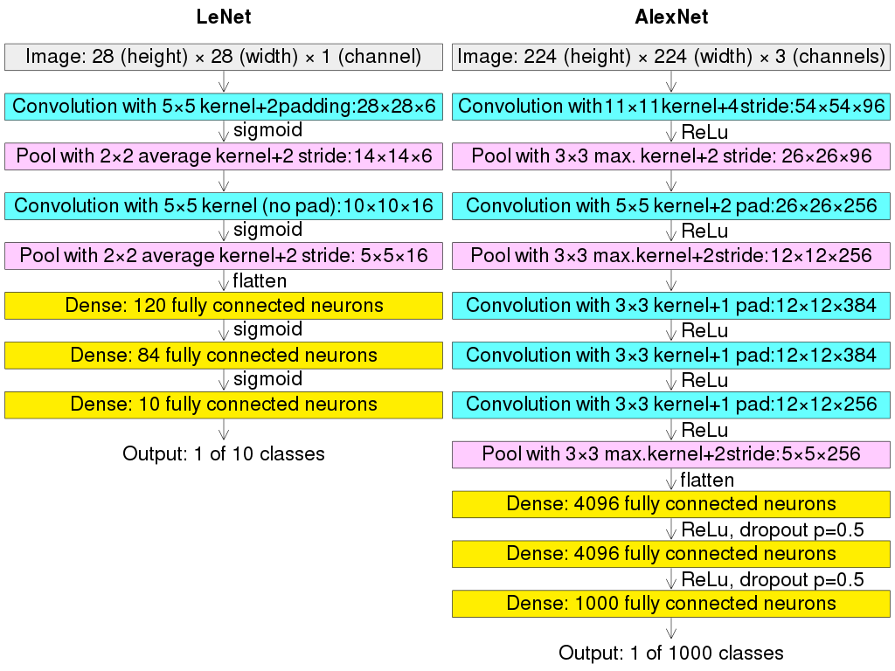

# 五大神经网络

- 卷积神经网络
- 循环神经网络
- 生成对抗网络
- Transformer
- LSTM长短时


## 第一章 卷积神经网络 CNN

- 卷积神经网络可以做什么任务：

  检测任务，分类与检索，超分辨率重构，医学任务，字体，标识识别，无人驾驶，人脸识别等

- **整体架构**：输入层，卷积层（提取特征），池化层（压缩特征），全连接层

  - 卷积做了一件什么事：利用卷积核提取图像的特征，得到**特征图**。

  - 图像颜色通道：RGB等颜色空间

  - 特征图个数：几个卷积核，就有几张特征图（每张图，每个通道）

  - 只做一次卷积可以吗？卷积层堆叠

    ```mermaid
    graph LR
    A[Image] --> B[Low-Level Feature]
    B --> C[Mid-Level Feature]
    C --> D[High-Level Feature]
    D --> E[Trainable Classifier]
    ```

    多次卷积，提取不同层次的特征

  - **卷积层涉及参数：滑动窗口步长，卷积核尺寸，边缘填充，卷积核个数**

  - **卷积结果计算公式**：

    - 长度：$H_2=\frac{H_1-F_H+2P}{S}+1$
    - 宽度：$W_2=\frac{W_1-F_W+2P}{S}+1$

    其中$W_1,H_1$ 表示输入的宽度，长度；$W_2,H_2$ 表示输出特征图的宽度，长度；$F$ 表示卷积核长和宽的大小；$S$ 表示滑动窗口的步长；$P$ 表示边界填充（加了几圈0）。

  - 卷积参数共享

  - **池化层**：压缩/下采样（通过某种方法）例如：maxpooling最大池化

- **经典网络-Alexnet**(2012)

  

- **经典网络-Vgg**（2014）

  

- **经典网络-Resnet**(2015)

  深层网络遇到的问题：深度越深，效果反而变差（20层以上）

  解决方案：==同等映射== （学习完了至少不会比原来差）

  

- 感受野：

  如果堆叠3个3×3的卷积层，并且保持滑动窗口步长为1，其感受野就是7×7的了，这跟一个使用7×7卷积核的结果是一样的。

  假设输入大小都是$h\times w\times c$，并且都使用$c$ 个卷积核（得到$c$ 个特征图），计算一下各自所需参数：

  - 一个$7\times7$卷积核所需参数$=c\times(7\times7\times c)=49c^2$ 
  - 三个$3\times3$卷积核所需参数$=3\times c\times(3\times3\times c)=27c^2$ 

  很明显，**堆叠小的卷积核所需的参数更少一些，并且卷积过程越多，特征提取也会越细致，加入的非线性变换也随着增多，还不会增大权重参数个数**。